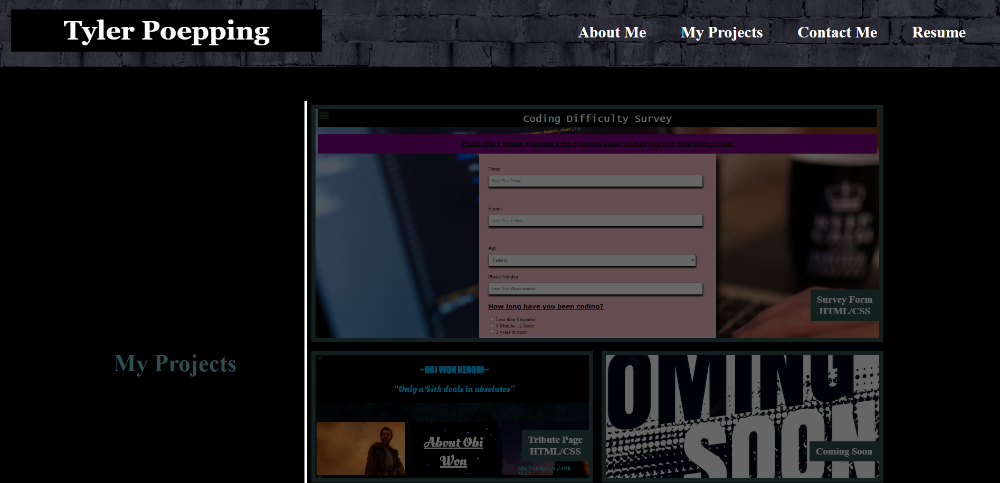

# Tylers Portfolio

# Description
- This is my most up to date portfolio. It is a work in progress so expect errors and non-functioning nav links as i continue to work and update it.

# Installation 
- No installation required

# Usage
- Use this portfolio at your discretion. Feel free to use the code or just play around with the features and see if you like it.

- You can view and use the page at (https://sspenelope.github.io/tyler-portfolio-v2/)

# Credits
- Myself for the creation of the portfolio

- UofM Coding bootcamp for the ideas and base prerequisits for the portoflio

# License
- No License at this time

# Badges
- No Badges to display at this time

## Features
- The "about me" and "my projects" nav links currently work. Will be implementing the last two shortly

- I'm planning to implement links to my projects ive made already. Check back later for when they are added

